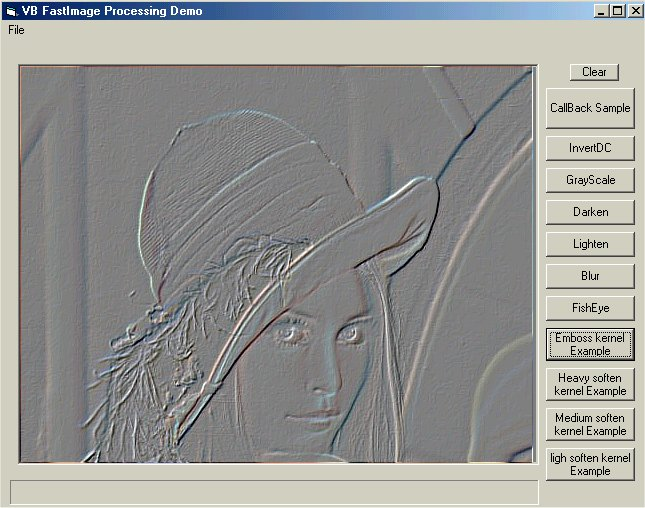

<div align="center">

## Fast image processing like in paintShopPro


</div>

### Description

This code shows how to do fast and professionnal image filtering

it shows also how to perform callBack function from VB to a c++ dll

The code source of the Dll filter engine is included

I'm waiting your feedbacks

Please Vote for my work if u think it's useful
 
### More Info
 


<span>             |<span>
---                |---
**Submitted On**   |2002-01-09 03:43:42
**By**             |[polaris](https://github.com/Planet-Source-Code/PSCIndex/blob/master/ByAuthor/polaris.md)
**Level**          |Advanced
**User Rating**    |4.7 (33 globes from 7 users)
**Compatibility**  |VB 4\.0 \(32\-bit\), VB 5\.0, VB 6\.0
**Category**       |[Graphics](https://github.com/Planet-Source-Code/PSCIndex/blob/master/ByCategory/graphics__1-46.md)
**World**          |[Visual Basic](https://github.com/Planet-Source-Code/PSCIndex/blob/master/ByWorld/visual-basic.md)
**Archive File**   |[Fast\_image47320182002\.zip](https://github.com/Planet-Source-Code/polaris-fast-image-processing-like-in-paintshoppro__1-30593/archive/master.zip)

### API Declarations

```
some GDI32 Appiz for great image processing
forget now Getpixel and set Pixel
Get all the pixel,manipulate them then blit them back in 10 milliseconds max.
```


